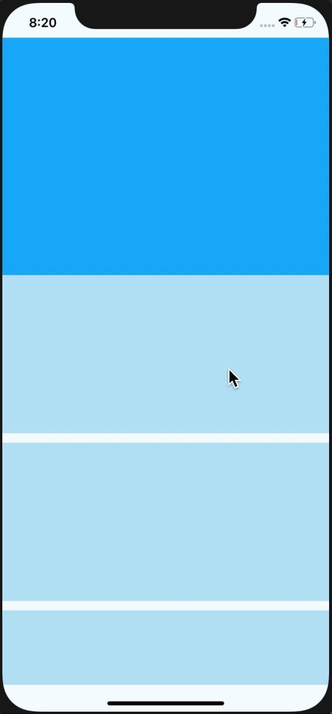

# react-native-collapsible-navbar-scrollview


[](https://img.shields.io/npm/v/@busfor/react-native-collapsible-navbar-scrollview/latest?style=for-the-badge)
[](https://img.shields.io/npm/types/typescript?style=for-the-badge)

React Native collapsible navBar implementation.

<div>


</div>

---

## Getting started

`$ yarn add react-native-collapsible-navbar-scrollview`

## Usage

```javascript
import { CollapsibleNavBarScrollView, CollapsibleNavBarState } from '@busfor/react-native-collapsible-navbar-scrollview'
```

```jsx
<CollapsibleNavBarScrollView
  headerMinHeight={56}
  headerMaxHeight={300}
  header={<View style={styles.header} />}
  animatedValue={/** Animated.Value for header animations **/}
  useNativeDriver={true} // for animatedValue
  initialState={CollapsibleNavBarState.open}
  onChangeState={(state) => {
    console.log(state)
  }} // CollapsibleNavBarState
  // ...other ScrollView props
>
  ...
</CollapsibleNavBarScrollView>
```
